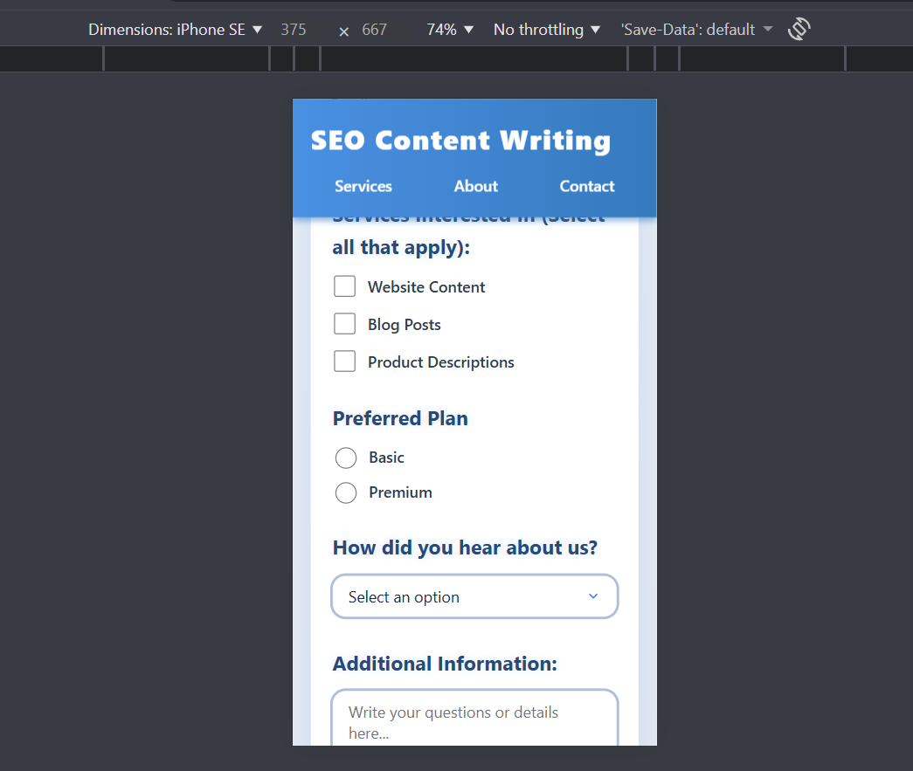
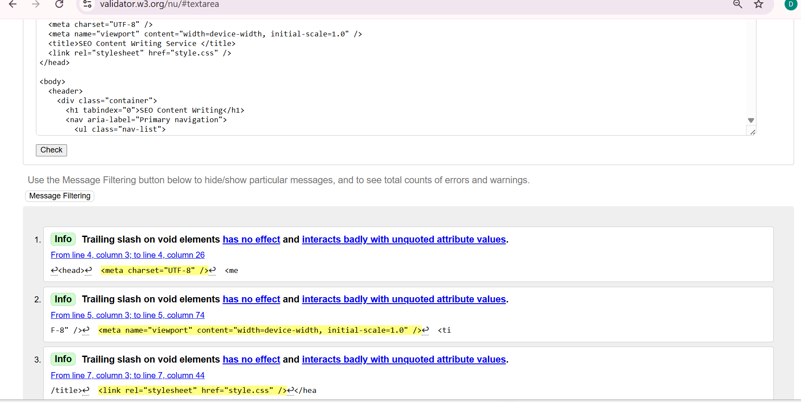
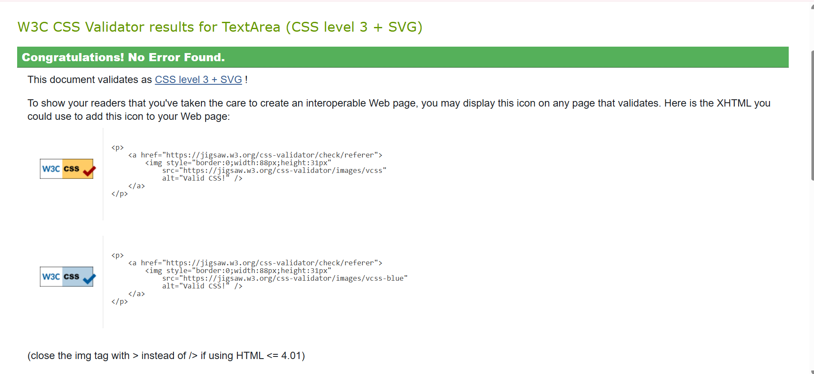

# SEO Content Writing – One Page Responsive Website  
IICT Assignment – HTML & CSS

## 1. Project Seed (Idea)
This project is a one page responsive website built for the IICT course assignment.  
The theme of the website is *SEO Content Writing*, presenting information about services, benefits, and SEO practices.  
The website demonstrates the use of semantic HTML structure, clean UI design, and mobile-first responsive CSS.

---

## 2. Design Rationale
* *Color Theme – Blue & White:*  
  A blue-and-white palette was selected because blue represents trust, clarity, and professionalism—qualities associated with SEO and digital marketing. White spacing improves readability and keeps the layout clean.

* *Typography & Layout:*  
  Headings use large, bold fonts for clear hierarchy. Text spacing is increased for readability.  
  Sections are separated using padding and subtle shadows for a modern look.

* *Responsiveness:*  
  Flexbox and media queries were applied to make the layout adapt across desktop, tablet, and mobile devices.  
  Images, sections, and navigation automatically reflow to maintain usability on smaller screens.

* *Use of Semantic Tags:*  
  Elements like <header>, <nav>, <section>, <article>, and <footer> ensure accessibility and proper document structure.

---

## 3. Screenshots

### Desktop View

### Tablet View

### Mobile View

---

## 4. Validator Proofs

### HTML Validator

### CSS Validator

---

## 5. How to Run the Project
Download or clone the repository, then open *index.html* in any browser.  
No external libraries are required — the project uses plain HTML5 and CSS3.

---
---

## 6. Git Commit Summary
Multiple commits were made throughout development, including:  
* Initial HTML structure  
* Added CSS styling  
* Added responsiveness with media queries  
* Improved UI spacing & layout  
* Organized screenshots folder  
* Updated README with all required documentation
